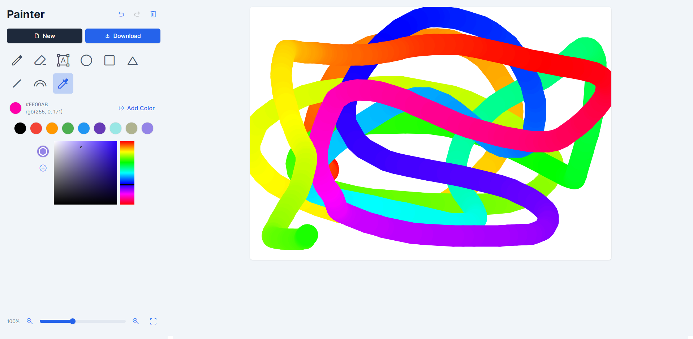
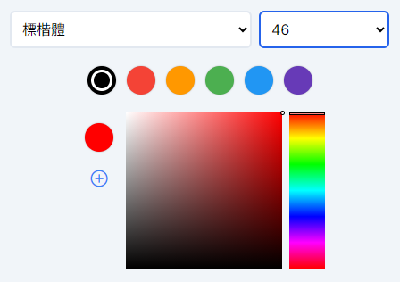
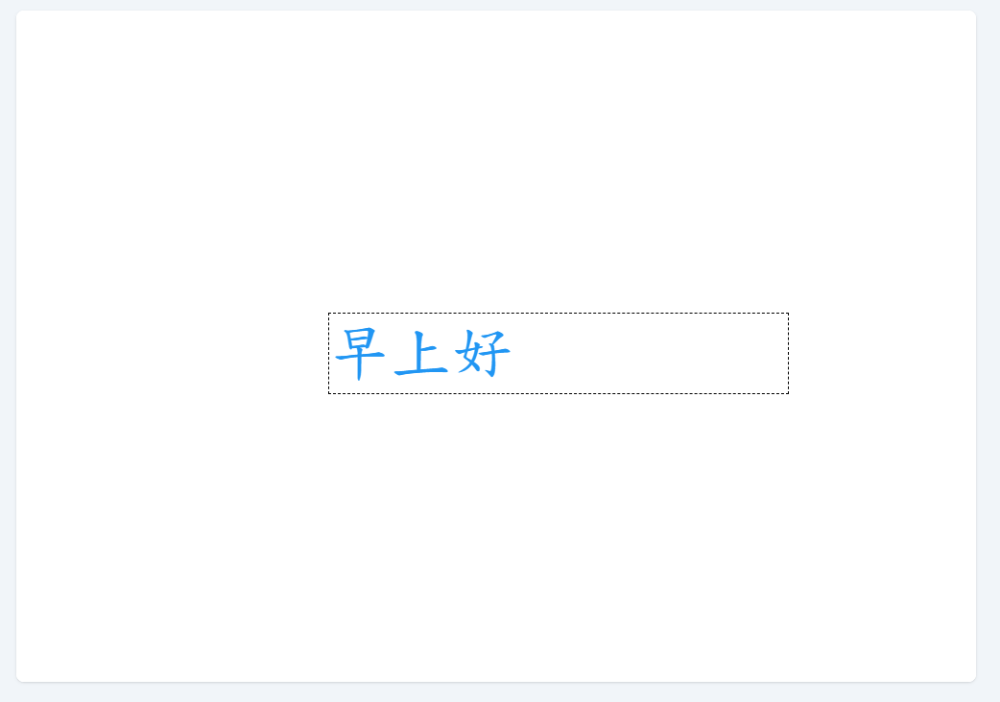
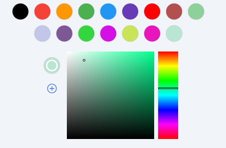
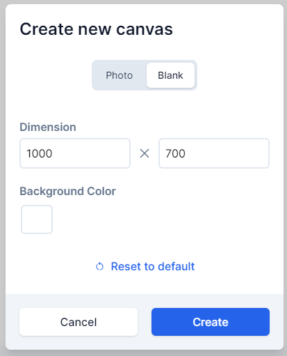

# Software Studio 2023 Spring
## Assignment 01 Web Canvas

### Scoring

| **Basic components** | **Score** | **Check** |
| :------------------- | :-------: | :-------: |
| Basic control tools  |    30%    |     Y     |
| Text input           |    10%    |     Y     |
| Cursor icon          |    10%    |     Y     |
| Refresh button       |    5%     |     Y     |

| **Advanced tools**     | **Score** | **Check** |
| :--------------------- | :-------: | :-------: |
| Different brush shapes |    15%    |     Y     |
| Un/Re-do button        |    10%    |     Y     |
| Image tool             |    5%     |     Y     |
| Download               |    5%     |     Y     |

| **Other useful widgets**         | **Score** | **Check** |
| :------------------------------- | :-------: | :-------: |
| 顏色暫存、快速存取               |   1~5%    |     Y     |
| 改變Canvas的高度、寬度、背景顏色 |   1~5%    |     Y     |

---

### How to use 

- 下圖是主要畫面，左邊為功能區，右邊為畫布。  

- 右上由左至右為復原、重作、重設(reset)。
  按下reset會跳出提示視窗，詢問是否要重設。
    

- 兩個按鈕由左至右為新增、下載。  
  下方功能區由左至右、由上至下分別為畫筆、橡皮擦、文字、圓形、矩形、三角形、直線、彩虹畫筆。  
  下方slider可以用來調整粗細。  
  

- 按下不同功能會有不同選項出現。  

- 選擇文字功能後請在畫布上任意地方點一下，便會跳出輸入框。  
  可以透過左方功能區改變字體、字形大小、顏色，輸入框的預覽會實時更新風格。 
  點擊畫布內空白處輸入框會消失，文字正式被印在畫布上。   
    
  

- 功能區下方的取色器由兩個canvas元素構成，可以直接點選取色。
也可以選擇上方的顏色。  

- 按下新增(new)按鈕後，會彈出視窗。  

- 如果要新增圖片，請直接點選"Upload"按鈕，選擇檔案。  

    

### Bonus Function description

- 可以透過網頁左下方的按鈕和Slider控制canvas的大小，預設大小100%為真實大小。  
  按鈕由左至右依序為縮小、放大、恢復成100%大小。  
  原理是調整canvas容器的CSS，設定為transform: scale(縮放大小); 來達成。
  
    
- 如果想要快速存取顏色，可以點選曲色器上方的圓形圖案來取色。
  也可以按下取色氣左方的加號將取得的顏色加入快速存取。  

- 可以在新增視窗按下"blank"標籤，便可以調整長度、寬度、背景色新增空白的canvas。  
  

### Web page link

    your web page URL.

### Others (Optional)

這份作業的前端使用tailwind CSS開發，而這個CSS Framework的優點就是沒有內建任何元件，如按鈕等，但有一堆Utilities，讓我可以做出完全符合自己想法的網頁。Bootstrap雖然有一堆元件，但容易被原有樣式影響，讓我想改樣式都要看一堆Bootstrap原本的CSS，了解邏輯才可以改。因為高中有學過網頁設計，在寫這份作業時較不會因為排版造成困擾。

將上傳圖片、新增空白畫布藏在彈出視窗裡是為了保持畫面的簡潔，ㄑㄧ

