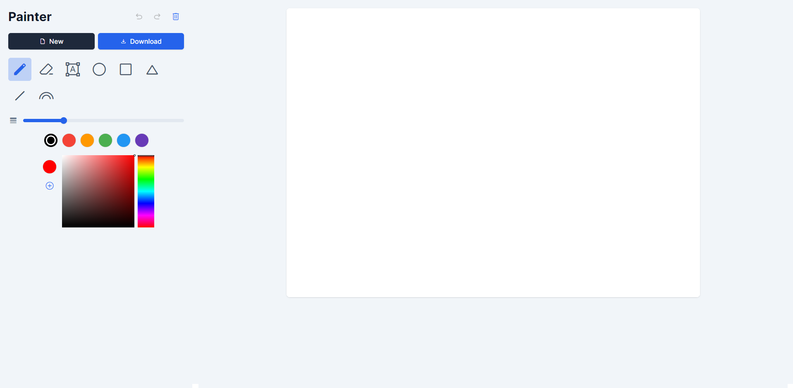
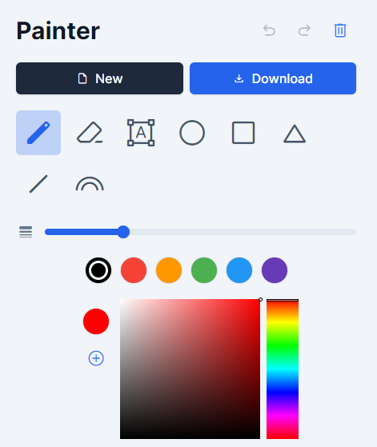
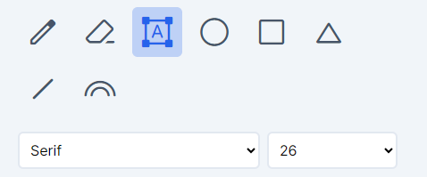
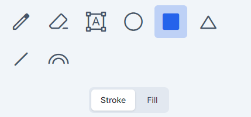
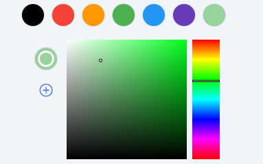
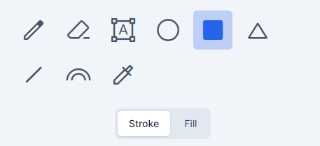
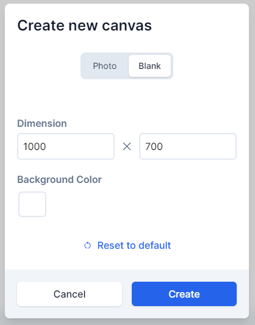

# Software Studio 2023 Spring
## Assignment 01 Web Canvas

### Scoring

| **Basic components** | **Score** | **Check** |
| :------------------- | :-------: | :-------: |
| Basic control tools  |    30%    |     Y     |
| Text input           |    10%    |     Y     |
| Cursor icon          |    10%    |     Y     |
| Refresh button       |    5%     |     Y     |

| **Advanced tools**     | **Score** | **Check** |
| :--------------------- | :-------: | :-------: |
| Different brush shapes |    15%    |     Y     |
| Un/Re-do button        |    10%    |     Y     |
| Image tool             |    5%     |     Y     |
| Download               |    5%     |     Y     |

| **Other useful widgets**         | **Score** | **Check** |
| :------------------------------- | :-------: | :-------: |
| 顏色暫存、快速存取               |   1~5%    |     Y     |
| 改變Canvas的高度、寬度、背景顏色 |   1~5%    |     Y     |

---

### How to use 

下圖是主要畫面，左邊為功能區，右邊為畫布。

右上由左至右為復原、重作、重設(reset)。  
兩個按鈕由左至右為新增、下載。  
下方功能區由左至右、由上至下分別為畫筆、橡皮擦、文字、圓形、矩形、三角形、直線、彩虹畫筆。  
下方slider可以用來調整粗細。

按下不同功能會有不同選項出現。

功能區下方的取色器由兩個canvas元素構成，可以直接點選取色。
也可以選擇上方的顏色。
若想儲存顏色，請按加號。

按下新增(new)按鈕後，會彈出視窗。

如果要新增圖片，請直接點選"Upload"按鈕。  
如果要新增空白畫布，請按"Blank"標籤。  
這裡可以改變畫布的大小和背景顏色。畫布的長寬限制在10到10000之間。

    

### Bonus Function description
    

### Web page link

    your web page URL.

### Others (Optional)

    Anything you want to say to TAs.

